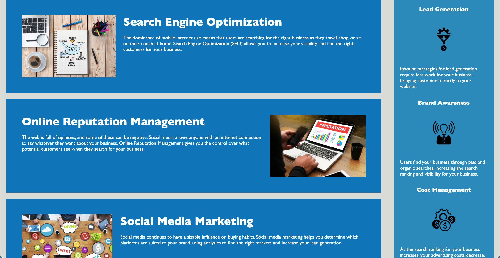
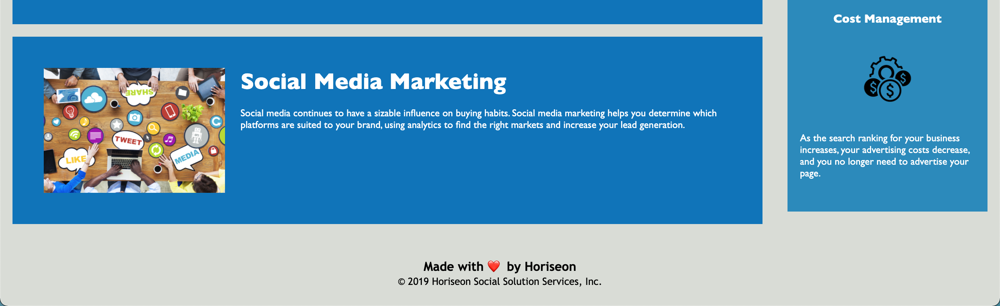

## Code Refactor Horiseon.RSC
## Purpose
-A webpage for the company, Horiseon that provides SEO consultation. 
-User can easily navigate the webpage to view the company's three main services which are Search Engine Optimization, Online Reputation Management, and Social Media Marketing. 
-The webpage also showcases the benefits the services can have for a prospective client. The client could increase their lead generation, brand awareness and lower their costs of advertisements. 
## Built with
-Webpage was built with HTML and CSS
-Webpage includes a header with navigation bar, cards with images and text, as well as a side panel featuring images and texts. 

## Webpage screenshots
    

    

    

## Submission
Deployed URL:<rudys212.github.io/Code-Refactor-Horiseon.RSC>       GitHub Repo URL:

